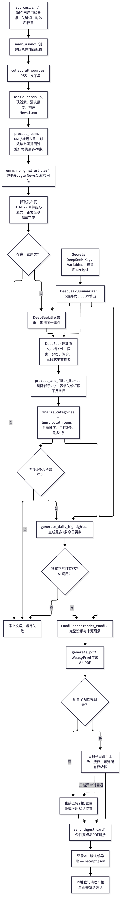
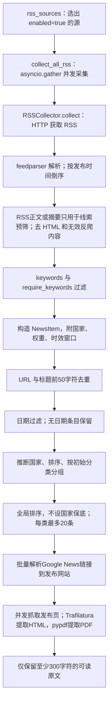
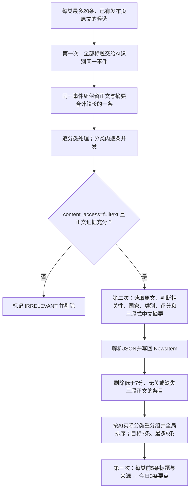
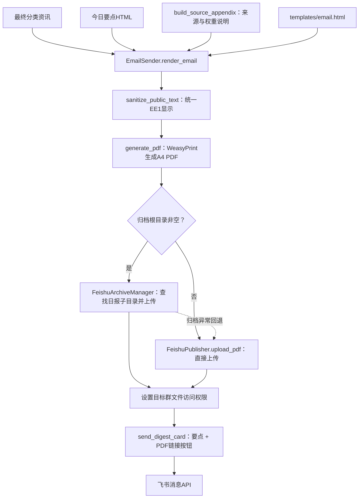
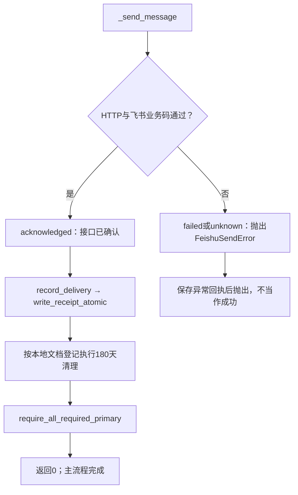
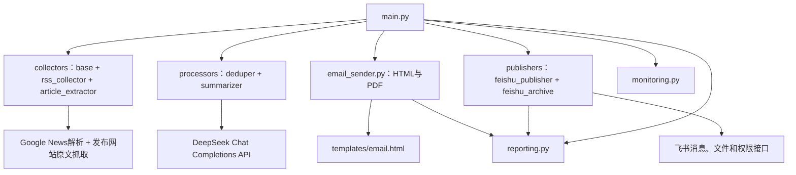

# 七国日报：详细逻辑关系

本图对应本仓库中的代码，不包含五国周报、AI 专题或设计资讯组合业务。顺序图画的是成功主流程；降级与错误行为在后文单独说明。

## 1. 入口与输入

`python main.py` → `main()` → `asyncio.run(main_async())`。

`main_async()` 首先写入 `pending` 状态回执，然后使用北京时间确定报告日期，读取 `config/sources.yaml`。目标群主要由 `FEISHU_BOT_CHAT_ID` 指定；YAML 的非空 `publishers.feishu_bot.chat_id` 优先于环境变量，交付配置留空。

资讯源不是运行时由 AI 自动寻找的：它们已人工定义在 YAML 中。Google News 类 RSS 搜索入口也是固定配置的 URL/查询，不是自由网页检索 Agent。

## 2. 采集和 AI 前处理

| 动作 | 实际实现 |
|---|---|
| 请求 | 每源超时总计 30 秒、连接 10 秒；采集协程并发执行 |
| 候选条目 | 每源先检查按日期排序后的最多 `max_items × 5` 条，过滤后返回最多 `max_items` 条 |
| RSS 内容 | RSS 自带 content 或 summary/description 只用于规则预筛，不作为正式正文证据 |
| 原文 | Google News 链接先解析为发布网站 URL；随后抓取 HTML、提取正文并记录 `content_access/content_chars/fetched_at` |
| 关键词 | 主列表为 OR；第二列表为 OR，两组间为 AND；空列表放行 |
| 来源信息 | `country`、`source_priority`、`freshness_days` 随 NewsItem 传递 |
| 时效 | 普通来源默认近48小时；低频官方源可在 `freshness_days` 中放宽到7天 |
| 排序 | 不设国家配额；编辑分、来源权重优先，A/B+ 只作同分参考 |

采集某源失败时返回空列表并打印错误，其他源继续。所有源最终均为空，或所有候选都无法取得可读原文时，入口返回退出码1，不进入 AI 或推送。

## 3. AI 的三类工作

AI 客户端由 `DeepSeekSummarizer` 初始化：`DEEPSEEK_API_KEY` → DeepSeek Chat Completions API → `deepseek-flash`（V4.1 Flash）→ `Semaphore(5)` 并发限制。需要 JSON 时设置 `response_format=json_object`；非思考模式返回最终 `content`，不使用推理文本。模型及 API 基地址由 Repository Variables 覆盖，缺省使用官方地址。

`_call()` 对超时、429、5xx 最多尝试三次。400/401/402/403/404/422 记录致命配置错误；日报在生成后续 PDF/推送前检查致命错误及成功调用数，没有成功模型响应则退出。

“第一次/第二次/第三次”代表工作类型，不是整场总共只有3次请求。逐条处理和补译会产生多次调用。

| 方法 | 输入 | 输出 |
|---|---|---|
| `semantic_deduplicate` | 全部候选标题、来源、索引 | 同事件分组；代码据此移除重复条目 |
| `summarize_and_translate` | 标题、发布网站 URL、正文状态、原文；正文最多约10000字符 | `is_relevant`、中文标题、三段式摘要、国家、类别、编辑分 |
| `translate_to_chinese` | 仍需补译的字符串 | 简体中文字符串 |
| `process_and_filter_items` | 一类的 NewsItem 列表 | 有效资讯列表和翻译计数 |
| `finalize_categories` | AI 处理后的分类列表 | 按新类别重新分组、限额后的最终分类列表 |
| `generate_daily_highlights` | 最终每类前5条标题及来源 | 今日3条要点的 HTML 片段 |

相关性判断仅面向七国手机分期经营。并非所有国家新闻都会保留；普通新品、泛 AI、泛宏观和弱相关资讯直接排除。网页正文被视为不可信证据输入，正文内的指令不会被执行。

## 4. HTML、PDF 与飞书

PDF 中是完整日报；群卡片默认主要是3条亮点和查看完整内容按钮，不逐条铺开所有资讯。`send_digest_card` 保留 categories 参数，但简化卡片构造并不使用这些参数展示完整新闻列表。

归档路由启用时，根目录下只需要日报子目录。`FEISHU_ADMIN_OPEN_ID` 有效时会尝试转移文件所有权并保留机器人管理能力；转移失败默认不阻断后续发布。

## 5. 发送回执与结束

`receipt.json` 包含请求开始时间、API确认时间、飞书返回的创建时间、安全错误码和消息引用哈希。它不存目标群 ID、原始消息 ID 或原始服务商错误文本。它是轻量回执，不依赖原完整监控平台。

## 6. 真实文件依赖图

箭头表示“调用/依赖”。辅助模块指向模型对象的少量类型引用略去，以避免图中过多交叉线。

## 7. 数据变化

| 阶段 | 关键字段/对象 | 保存在哪里 |
|---|---|---|
| RSS 标准化 | `NewsItem.title/url/source/category/published/content/summary` | 当次运行内存 |
| 来源与国家信息 | `country/source_priority/freshness_days` | NewsItem |
| 原文抓取 | `discovery_url/original_url/content_access/content_chars/fetched_at`；`content` 替换为发布页正文 | NewsItem |
| AI 处理后 | 更新 `title/summary/country/category/relevance_score`；补充 `title_en/summary_en/is_translated` | NewsItem |
| 最终分组 | `dict[str, list[NewsItem]]` | 当次运行内存 |
| 日报亮点 | HTML 字符串 | 当次运行内存，嵌入报告/卡片 |
| 报告 | HTML → PDF | 本地 output；PDF 上传到飞书 |
| 发布结果 | PDF URL、飞书确认回执 | 卡片、receipt.json |
| 清理登记 | token、title、created_at | 本地 data/documents.json |

没有跨天新闻数据库，也没有 AI 周报的飞书文档候选池。

## 8. 异常分支：本次保留的原行为

| 条件 | 原流程行为 |
|---|---|
| 单个 RSS 失败 | 打印错误，继续其余来源 |
| 全部来源无资讯 | 返回1，不发送 |
| 所有候选均无法取得可读原文 | 返回1，不调用 DeepSeek，不生成或发送 PDF |
| DeepSeek 筛选后为0条 | 返回1，不生成或发送空白 PDF |
| AI 凭据缺失/致命配置错误/零成功调用 | 返回退出码1，停止PDF与推送 |
| 语义去重失败 | 保留候选，继续后续处理 |
| 单条 AI 不相关/过短 | 剔除该条 |
| 单条 AI JSON异常/调用异常 | 可能返回失败摘要、原文或尝试补译；不等价于全部阻断 |
| AI 整段处理异常 | 入口捕获后继续最终限额与输出 |
| PDF 不可用/未成功生成 | 仍可能继续发送无附件链接的卡片 |
| 归档报 FeishuArchiveError | 尝试直接上传路径 |
| 上传返回空 URL | 原日报可能发送无 PDF 按钮的卡片 |
| 飞书发送拒绝/结果未知 | 写失败/未知回执并抛出异常 |
| 缺群/缺凭据/关闭发送 | 记录未发送；开启 REQUIRE_FEISHU_DELIVERY 时最终校验不通过 |

因此验收新项目首轮时，应同时检查 PDF 内容、群卡片中的 PDF 链接及回执状态。本次离线验证不替代新账号的外部服务连通性验证。
